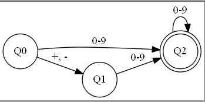
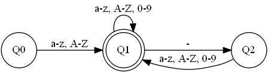
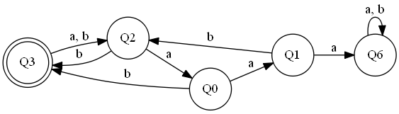

# Recognition and Automata
Automata is a mathematical machine designed to **recognize languages**

 * Σ is the alphabet 
 * Q is set of states
    * Q0 ? Q is the initial state 
    * F ∈ Q are accept states
    * δ are transition functions 

Given an automata and an input string, following transition functions based on input is called a *run.*

**Law:** For any regular expression there is an automata, and vice-versa

**Example:** Create an automata for ```(+|-)?[0-9]+```



**Example:** Create an automata for ```L(L|D)*(-(L|D)+)*``` where ```L = [A-Za-z]``` and ```D = [0-9]```




## Encoding an Automata 
Use a variable to remember what state you are in, use a switch-case to perform operations for each state. 

**Example:** Σ = {a, b} 


```cpp
// Assumes that S is only composed of 'a's and 'b's
bool recognition(string s) { 
	int k = 0; // Counter for string 
	int state = 0; // Current state 
	while (k < s.size()) { 
		switch (state) { 
			case 0: 
				if (s[k] == 'a') {
					sate = 1; 
				} else { 
					state = 3;
				}
				break;
			case 1: 
				if (s[k] == 'a') { 
					return false; // Failure 
				} else { 
					state = 2;
				}
				break; 
			case 2: 
				if (s[k] == 'a') { 
					state = 0;
				} else { 
					state = 3;
				}
				break;
			case 3: 
				state = 2; 
				break;
		}
		k++; // Advance through the string
	}
	return (state == 3); // True if in final state
}

recognition("abb"); // True 
recognition("abaaa"); // False
```